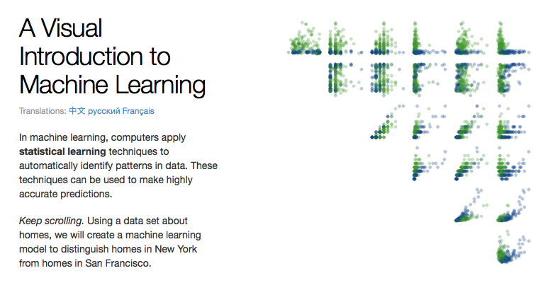

```{r setup, include=FALSE}
knitr::opts_chunk$set(
  echo = TRUE,
  fig.align = "center"
)
```

```{r, echo=FALSE, out.width="100%", fig.cap="Decision Tree visualization by Tony Chu and Stephanie Yee."}
knitr::include_graphics("./images/dt.png")
```


## Introduction

Classification and regression trees (CART) are a non-parametric [decision tree learning](https://en.wikipedia.org/wiki/Decision_tree_learning) technique that produces either classification or regression trees, depending on whether the dependent variable is categorical or numeric, respectively.  CART is both a generic term to describe tree algorithms and also a specific name for Breiman's original algorithm for constructing classification and regression trees.

- **Decision Tree:** A tree-shaped graph or model of decisions used to determine a course of action or show a statistical probability.
- **Classification Tree:** A decision tree that performs classification (predicts a categorical response).
- **Regression Tree:** A decision tree that performs regression (predicts a numeric response).
- **Split Point:** A split point occurs at each node of the tree where a decision is made (e.g. x > 7 vs. x &leq; 7).
- **Terminal Node:** A terminal node is a node which has no descendants (child nodes).  Also called a "leaf node."

## Properties of Trees

- Can handle huge datasets.
- Can handle *mixed* predictors implicitly -- numeric and categorical.
- Easily ignore redundant variables.
- Handle missing data elegantly through *surrogate splits*.
- Small trees are easy to interpret.
- Large trees are hard to interpret.
- Prediction performance is often poor (high variance).

## Tree Algorithms

There are a handful of different tree algorithms in addition to Breiman's original CART algorithm.  Namely, [ID3](https://en.wikipedia.org/wiki/ID3_algorithm), [C4.5](https://en.wikipedia.org/wiki/C4.5_algorithm) and [C5.0](https://en.wikipedia.org/wiki/C4.5_algorithm#Improvements_in_C5.0.2FSee5_algorithm), all created by [Ross Quinlan](https://en.wikipedia.org/wiki/Ross_Quinlan).  C5.0 is an improvement over C4.5, however, the C4.5 algorithm is still quite popular since the multi-threaded version of C5.0 is proprietary (although the single threaded is released as GPL). 

## CART vs C4.5

Here are some of the differences between CART and C4.5:

- Tests in CART are always binary, but C4.5 allows two or more outcomes.
- CART uses the Gini diversity index to rank tests, whereas C4.5 uses information-based criteria.
- CART prunes trees using a cost-complexity model whose parameters are estimated by
cross-validation; C4.5 uses a single-pass algorithm derived from binomial confidence
limits.
- With respect to missing data, CART looks for surrogate tests that approximate the outcomes when the tested attribute has an unknown value, but C4.5 apportions the case probabilistically among the outcomes. 


Decision trees are formed by a collection of rules based on variables in the modeling data set:

1. Rules based on variables' values are selected to get the best split to differentiate observations based on the dependent variable.
2. Once a rule is selected and splits a node into two, the same process is applied to each "child" node (i.e. it is a recursive procedure).
3. Splitting stops when CART detects no further gain can be made, or some pre-set stopping rules are met. (Alternatively, the data are split as much as possible and then the tree is later pruned.)

Each branch of the tree ends in a terminal node. Each observation falls into one and exactly one terminal node, and each terminal node is uniquely defined by a set of rules.

## Splitting Criterion & Best Split

The original CART algorithm uses the Gini Impurity, whereas ID3, C4.5 and C5.0 use Entropy or Information Gain (related to Entropy).

### Gini Impurity

Used by the CART algorithm, [Gini Impurity](https://en.wikipedia.org/wiki/Decision_tree_learning#Gini_impurity) is a measure of how often a randomly chosen element from the set would be incorrectly labeled if it was randomly labeled according to the distribution of labels in the subset. Gini impurity can be computed by summing the probability $f_i$ of each item being chosen times the probability $1 − f_i$ of a mistake in categorizing that item. It reaches its minimum (zero) when all cases in the node fall into a single target category.

To compute Gini impurity for a set of m items, suppose $i ∈ {1, 2, ..., m}$, and let $f_i$ be the fraction of items labeled with value $i$ in the set.

$$ I_{G}(f)=\sum _{i=1}^{m}f_{i}(1-f_{i})=\sum _{i=1}^{m}(f_{i}-{f_{i}}^{2})=\sum _{i=1}^{m}f_{i}-\sum _{i=1}^{m}{f_{i}}^{2}=1-\sum _{i=1}^{m}{f_{i}}^{2}=\sum _{i\neq k}f_{i}f_{k}$$

### Entropy

[Entropy](https://en.wikipedia.org/wiki/ID3_algorithm#Entropy), $H(S)$, is a measure of the amount of uncertainty in the (data) set $S$ (i.e. entropy characterizes the (data) set $S$).

$$ H(S)=-\sum _{{x\in X}}p(x)\log _{{2}}p(x) $$

Where,
- $S$ is the current (data) set for which entropy is being calculated (changes every iteration of the ID3 algorithm)
- $X$ is set of classes in $S$
- $p(x)$ is the ratio of the number of elements in class $x$ to the number of elements in set $S$

When $H(S)=0$, the set $S$ is perfectly classified (i.e. all elements in $S$ are of the same class).

In ID3, entropy is calculated for each remaining attribute. The attribute with the smallest entropy is used to split the set $S$ on this iteration. The higher the entropy, the higher the potential to improve the classification here.

### Information gain

Information gain $IG(A)$ is the measure of the difference in entropy from before to after the set $S$ is split on an attribute $A$: in other words, how much uncertainty in $S$ was reduced after splitting set $S$ on attribute $A$.

$$ IG(A,S)=H(S)-\sum _{{t\in T}}p(t)H(t)$$

Where,
- $H(S)$ is the entropy of set $S$
- $T$ is the set of subsets created from splitting set $S$ by attribute $A$ such that $S=\bigcup _{{t\in T}}t$
- $p(t)$ is the ratio of the number of elements in $t$ to the number of elements in set $S$
- $H(t)$ is the entropy of subset $t$

In ID3, information gain can be calculated (instead of entropy) for each remaining attribute. The attribute with the *largest* information gain is used to split the set $S$ on this iteration.

## Decision Boundary

This is an example of a decision boundary in two dimensions of a (binary) classification tree.  The black circle is the Bayes Optimal decision boundary and the blue square-ish boundary is learned by the classification tree.

```{r, echo=FALSE, out.width="100%", fig.cap="Source: Elements of Statistical Learning."}
knitr::include_graphics("./images/boundary_dt.png")
```


## Missing Data

CART is an algorithm that deals effectively with missing values through *surrogate splits*.


## Visualizing Decision Trees

```{r, echo=FALSE, out.width="100%", fig.cap="Source: Elements of Statistical Learning."}

```

[Tony Chu](https://twitter.com/tonyhschu) and [Stephanie Yee](https://twitter.com/stephaniejyee) designed an award-winning visualization of how decision trees work called "A Visual Introduction to Machine Learning."  Their interactive D3 visualization is available [here](http://www.r2d3.us/visual-intro-to-machine-learning-part-1/).


# CART Software in R

Since it's more common in machine learning to use trees in an ensemble, we'll skip the code tutorial for CART in R. For reference, trees can be grown using the [rpart](https://cran.r-project.org/web/packages/rpart/index.html) package, among others.
