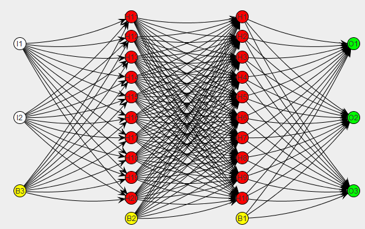
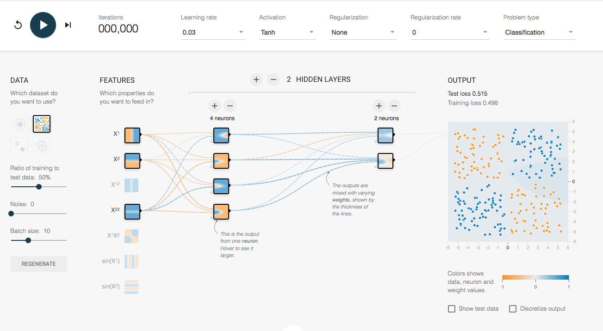

# Deep Neural Networks

* * *

* * *
Image Source: https://machprinciple.wordpress.com/2013/11/09/neural-network-
controlled-spacecraft-control-logic-exists/

## Introduction

A [Deep Neural Network](https://en.wikipedia.org/wiki/Deep_learning#Deep_neural_
network_architectures) (DNN) is an [artificial neural
network](https://en.wikipedia.org/wiki/Artificial_neural_network) (ANN) with
multiple hidden layers of units between the input and output layers.  Similar to
shallow ANNs, DNNs can model complex non-linear relationships. DNN architectures
(e.g. for object detection and parsing) generate compositional models where the
object is expressed as a layered composition of image primitives. The extra
layers enable composition of features from lower layers, giving the potential of
modeling complex data with fewer units than a similarly performing shallow
network.

DNNs are typically designed as
[feedforward](https://en.wikipedia.org/wiki/Feedforward_neural_network)
networks, but research has very successfully applied recurrent neural networks,
especially LSTM, for applications such as language modeling. Convolutional deep
neural networks (CNNs) are used in computer vision where their success is well-
documented. CNNs also have been applied to acoustic modeling for automatic
speech recognition, where they have shown success over previous models.

This tutorial will cover DNNs, however, we will introduce the concept of a
"shallow" neural network as a starting point.

## History

An interesting fact about neural networks is that the first artificial neural
network was implemented in hardware, not software.  In 1943, neurophysiologist
Warren McCulloch and mathematician Walter Pitts wrote a paper on how neurons
might work. In order to describe how neurons in the brain might work, they
modeled a simple neural network using electrical circuits. [1]

## Backpropagation

[Backpropagation](https://en.wikipedia.org/wiki/Backpropagation), an
abbreviation for "backward propagation of errors", is a common method of
training artificial neural networks used in conjunction with an optimization
method such as [gradient
descent](https://en.wikipedia.org/wiki/Gradient_descent). The method calculates
the gradient of a loss function with respect to all the weights in the network.
The gradient is fed to the optimization method which in turn uses it to update
the weights, in an attempt to minimize the loss function.


## Architectures

### Multilayer Perceptron (MLP)

A [multilayer perceptron](https://en.wikipedia.org/wiki/Multilayer_perceptron)
(MLP) is a [feed-
forward](https://en.wikipedia.org/wiki/Feedforward_neural_network) artificial
neural network model that maps sets of input data onto a set of appropriate
outputs. This is also called a fully-connected fFeed-forward ANN.  An MLP
consists of multiple layers of nodes in a directed graph, with each layer fully
connected to the next one. Except for the input nodes, each node is a neuron (or
processing element) with a nonlinear activation function. MLP utilizes a
supervised learning technique called backpropagation for training the network.
MLP is a modification of the standard linear perceptron and can distinguish data
that are not linearly separable.

")
Image Souce: neuralnetworksanddeeplearning.com

### Recurrent

A [recurrent neural
network](https://en.wikipedia.org/wiki/Recurrent_neural_network) (RNN) is a
class of artificial neural network where connections between units form a
directed cycle. This creates an internal state of the network which allows it to
exhibit dynamic temporal behavior. Unlike feed-forward neural networks, RNNs can
use their internal memory to process arbitrary sequences of inputs. This makes
them applicable to tasks such as unsegmented connected handwriting recognition
or speech recognition.

There are a number of Twitter bots that are created using LSTMs.  Some fun
examples are [@DeepDrumpf](https://twitter.com/DeepDrumpf) and
[@DeepLearnBern](https://twitter.com/DeepLearnBern) by [Brad
Hayes](https://twitter.com/hayesbh) from MIT.

")


### Convolutional

A [convolutional neural
network](https://en.wikipedia.org/wiki/Convolutional_neural_network) (CNN, or
ConvNet) is a type of [feed-
forward](https://en.wikipedia.org/wiki/Feedforward_neural_network) artificial
neural network in which the connectivity pattern between its neurons is inspired
by the organization of the animal visual cortex, whose individual neurons are
arranged in such a way that they respond to overlapping regions tiling the
visual field. Convolutional networks were inspired by biological processes and
are variations of multilayer perceptrons designed to use minimal amounts of
preprocessing. They have wide applications in image and video recognition,
recommender systems and natural language processing.

Some creative application of CNNs are [DeepDream](https://github.com/ledell
/grayarea-deepdream) images and [Neural Style Transfer](https://github.com/fzliu
/style-transfer).

")

## Visualizing Neural Nets




[http://playground.tensorflow.org](http://playground.tensorflow.org/#activation=
tanh&batchSize=10&dataset=xor&regDataset=reg-plane&learningRate=0.03&regularizat
ionRate=0&noise=0&networkShape=4,2&seed=0.21753&showTestData=false&discretize=fa
lse&percTrainData=50&x=true&y=true&xTimesY=false&xSquared=false&ySquared=true&co
sX=false&sinX=false&cosY=false&sinY=false&collectStats=false&problem=classificat
ion&initZero=false) is a website where you can tweak and visualize neural
networks.


***

# Deep Learning Software in R

For the purposes of this tutorial, we will review CPU-based deep learning
packages in R that support numeric, tabular data (data frames).  There is deep
learning software that supports image data directly, but we will not cover those
features in this tutorial.  The demos below will train a fully-connected, feed-
forward ANN (aka mutilayer perceptron) using the
[mxnet](http://mxnet.readthedocs.io/en/latest/how_to/build.html#r-package-
installation) and [h2o](https://cran.r-project.org/web/packages/h2o/index.html)
R packages.  Also worth noting are two other Deep Learning packages in R,
[deepnet](https://cran.r-project.org/web/packages/deepnet/index.html) and
[darch](https://cran.r-project.org/web/packages/darch/index.html) (which I don't
have much experience with).

## MXNet

Authors: [Tianqi Chen](http://homes.cs.washington.edu/~tqchen/), [Qiang Kou
(KK)](https://github.com/thirdwing), et. al.

Backend: C++

[MXNet](http://mxnet.readthedocs.io/en/latest/) is deep neural net
implementation by the same authors as
[xgboost](https://xgboost.readthedocs.io/en/latest/), and a part of the same
umbrella project called [DMLC](http://dmlc.ml/) (Distributed Machine Learning
Community). The [MXNet R
package](http://mxnet.readthedocs.io/en/latest/packages/r/index.html) brings
flexible and efficient GPU computing and state-of-art deep learning to R.

Features:
- It enables you to write seamless tensor/matrix computation with multiple GPUs
in R.
- Distributed computation.
- Read image files directly.
- Offers both a simplified and complex interface for architecting networks.
- Supports mulit-layer feed-forward ANNs (aka. [multi-layer perceptrons
(MLP)](https://en.wikipedia.org/wiki/Multilayer_perceptron)).
- Supports [Convolutional Neural Networks
(CNN)](https://en.wikipedia.org/wiki/Convolutional_neural_network) -- good for
image recognition.
- Supports [Long Short-term memory (LSTM)](https://en.wikipedia.org/wiki
/Long_short-term_memory), a type of [Recurrent Neural Network
(RNN)](https://en.wikipedia.org/wiki/Recurrent_neural_network) -- good for
sequence learning, (e.g. speech, text).
- License: BSD

MXNet Example code below modified from: http://www.r-bloggers.com/deep-learning-
with-mxnetr/
The example below contains the canonical 60k/10k MNIST train/test files as
opposed to the Kaggle version in the blog post.

```{r   n=4}
# Install pre-build CPU-based mxnet package (no GPU support)
#install.packages("drat")
#drat:::addRepo("dmlc")
#install.packages("mxnet")
```


```{r   n=6}
library(mxnet)
```

```{r   n=7}
# Data load & preprocessing

train <- read.csv("data/mnist_train.csv", header = TRUE)
test <- read.csv("data/mnist_test.csv", header = TRUE)
train <- data.matrix(train)
test <- data.matrix(test)

train <- data.matrix(train)
test <- data.matrix(test)

train_x <- train[,-785]
train_y <- train[,785]
test_x <- test[,-785]
test_y <- test[,785]

# lineraly transform it into [0,1]
# transpose input matrix to npixel x nexamples (format expected by mxnet)
train_x <- t(train_x/255)
test_x <- t(test_x/255)

#see that the number of each digit is fairly even
table(train_y)
```


```{r   n=8}
# Configure the structure of the network

#in mxnet use its own data type symbol to configure the network
data <- mx.symbol.Variable("data")

#set the first hidden layer where data is the input, name and number of hidden neurons
fc1 <- mx.symbol.FullyConnected(data, name = "fc1", num_hidden = 128)

#set the activation which takes the output from the first hidden layer fc1
act1 <- mx.symbol.Activation(fc1, name = "relu1", act_type = "relu")

#second hidden layer takes the result from act1 as the input, name and number of hidden neurons
fc2 <- mx.symbol.FullyConnected(act1, name = "fc2", num_hidden = 64)

#second activation which takes the output from the second hidden layer fc2
act2 <- mx.symbol.Activation(fc2, name = "relu2", act_type = "relu")

#this is the output layer where number of nuerons is set to 10 because there's only 10 digits
fc3 <- mx.symbol.FullyConnected(act2, name = "fc3", num_hidden = 10)

#finally set the activation to softmax to get a probabilistic prediction
softmax <- mx.symbol.SoftmaxOutput(fc3, name = "sm")
```

```{r   n=9}
#set which device to use before we start the computation
#assign cpu to mxnet
devices <- mx.cpu()

#set seed to control the random process in mxnet
mx.set.seed(0)

#train the nueral network
model <- mx.model.FeedForward.create(softmax, 
                                     X = train_x, 
                                     y = train_y,
                                     ctx = devices, 
                                     num.round = 10, 
                                     array.batch.size = 100,
                                     learning.rate = 0.07, 
                                     momentum = 0.9,
                                     eval.metric = mx.metric.accuracy,
                                     initializer = mx.init.uniform(0.07),
                                     epoch.end.callback = mx.callback.log.train.metric(100))
```


```{r   n=10}
#make a prediction
preds <- predict(model, test_x)
dim(preds)
# [1]    10 10000

#matrix with 10000 rows and 10 columns containing the classification probabilities from the output layer
#use max.col to extract the maximum label for each row
pred_label <- max.col(t(preds)) - 1
table(pred_label)

# Compute accuracy
acc <- sum(test_y == pred_label)/length(test_y)
print(acc)
```


MXNet also has a simplified api,
[mx.mlp()](https://github.com/dmlc/mxnet/blob/master/R-package/R/mlp.R), which
provides a more generic interface compared to the network construction procedure
above.

## h2o

Authors: [Arno Candel](https://www.linkedin.com/in/candel), H2O.ai contributors

Backend: Java

[H2O Deep Learning](http://docs.h2o.ai/h2o/latest-stable/h2o-
docs/booklets/DeepLearningBooklet.pdf) builds a feed-forward multilayer
artificial neural network on an distributed H2O data frame.

Features:

- Distributed and parallelized computation on either a single node or a multi-
node cluster.
- Data-distributed, which means the entire dataset does not need to fit into
memory on a single node.
- Uses [HOGWILD!](http://pages.cs.wisc.edu/~brecht/papers/hogwildTR.pdf) for
fast computation.
- Simplified network building interface.
- Fully connected, feed-forward ANNs only (CNNs and LSTMs in development).
- CPU only (GPU interface in development).
- Automatic early stopping based on convergence of user-specied metrics to user-
specied relative tolerance.
- Support  for  exponential  families  (Poisson,  Gamma,  Tweedie)  and  loss
functions in addition to binomial (Bernoulli), Gaussian and multinomial
distributions, such as Quantile regression (including Laplace)ˆ.
- Grid search for hyperparameter optimization and model selection.
- Apache 2.0 Licensed.
- Model export in plain Java code for deployment in production environments.
- GUI for training & model eval/viz (H2O Flow).

```{r   n=11}
library(h2o)
h2o.init(nthreads = -1)  # This means nthreads = num available cores
```


```{r   n=22}
# Data load & preprocessing

train <- h2o.importFile("data/mnist_train.csv")
test <- h2o.importFile("data/mnist_test.csv")

# Specify the response and predictor columns
y <- "C785"
x <- setdiff(names(train), y)

# We encode the response column as categorical for multinomial classification
train[,y] <- as.factor(train[,y])
test[,y] <- as.factor(test[,y])
```


```{r   n=21}
# Get model performance on a test set
perf <- h2o.performance(model, test)

# Or get the preds directly and compute classification accuracy
preds <- h2o.predict(model, newdata = test)
acc <- sum(test[,y] == preds$predict)/nrow(test)
print(acc)
```


# References

[1] [http://cs.stanford.edu/people/eroberts/courses/soco/projects/neural-network
s/History/history1.html](http://cs.stanford.edu/people/eroberts/courses/soco/pro
jects/neural-networks/History/history1.html)
