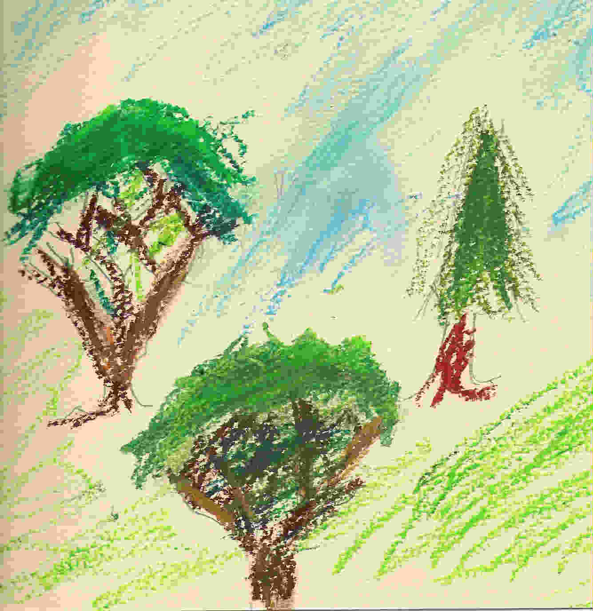
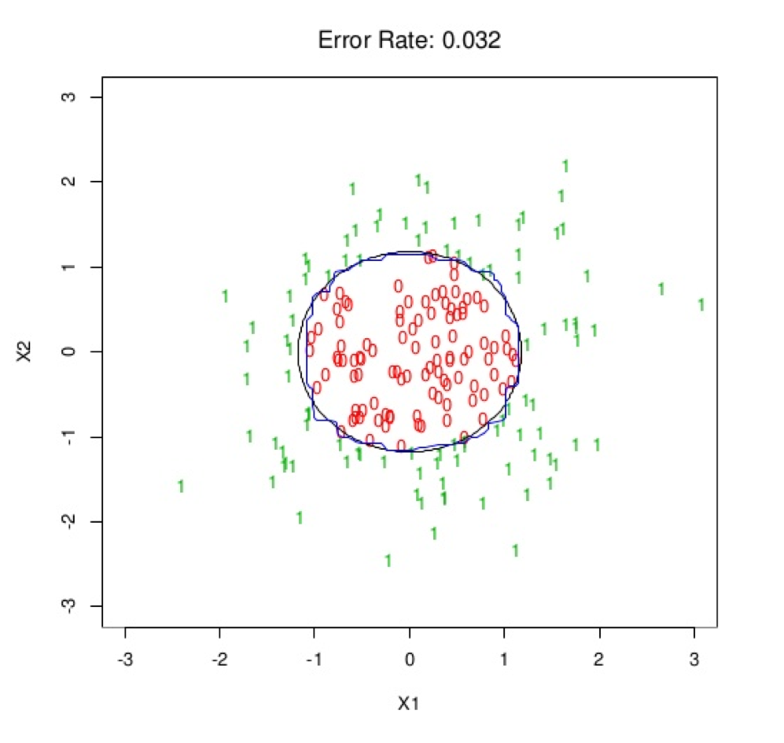
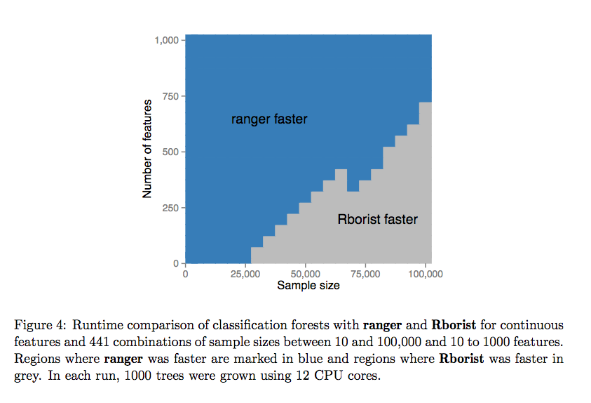

# Random Forest

* * *

* * *
Drawing by Phil Cutler.

## Introduction

Any tutorial on [Random Forests](https://en.wikipedia.org/wiki/Random_forest)
(RF) should also include a review of decicion trees, as these are models that
are ensembled together to create the Random Forest model -- or put another way,
the "trees that comprise the forest."  Much of the complexity and detail of the
Random Forest algorithm occurs within the individual decision trees and
therefore it's important to understand decision trees to understand the RF
algorithm as a whole.  Therefore, before proceeding, it is recommended that you
read through the accompanying [Classification and Regression Trees Tutorial
](decision-trees.ipynb).


## History

The Random Forest algorithm is preceeded by the [Random Subspace
Method](https://en.wikipedia.org/wiki/Random_subspace_method) (aka "attribute
bagging"), which accounts for half of the source of randomness in a Random
Forest.  The Random Subspace Method is an ensemble method that consists of
several classifiers each operating in a subspace of the original feature space.
The outputs of the models are then combined, usually by a simple majority vote.
Tin Kam Ho applied the random subspace method to decision trees in 1995.

[Leo Breiman](https://en.wikipedia.org/wiki/Leo_Breiman) and [Adele
Culter](http://www.math.usu.edu/~adele/) combined Breiman's
[bagging](https://en.wikipedia.org/wiki/Bootstrap_aggregating) idea with the
random subspace method to create a "Random Forest", a name which is trademarked
by the duo.  Due to the trademark, the algorithm is sometimes called Random
Decision Forests.

The introduction of random forests proper was first made in a
[paper](http://www.stat.berkeley.edu/~breiman/randomforest2001.pdf) by Leo
Breiman [1]. This paper describes a method of building a forest of uncorrelated
trees using a CART like procedure, combined with randomized node optimization
and bagging. In addition, this paper combines several ingredients, some
previously known and some novel, which form the basis of the modern practice of
random forests, in particular:

- Using [out-of-bag error](https://en.wikipedia.org/wiki/Out-of-bag_error) as an
estimate of the [generalization
error](https://en.wikipedia.org/wiki/Generalization_error).
- Measuring [variable
importance](https://en.wikipedia.org/wiki/Random_forest#Properties) through
permutation.

The report also offers the first theoretical result for random forests in the
form of a bound on the generalization error which depends on the strength of the
trees in the forest and their correlation.

Although Brieman's implemenation of Random Forests used his CART algorithm to
construct the decision trees, many modern implementations of Random Forest use
entropy-based algorithms for constructing the trees.

## Bagging

Bagging (Bootstrap aggregating) was proposed by Leo Breiman in 1994 to improve
the classification by combining classifications of randomly generated training
sets.  Although it is usually applied to decision tree methods, it can be used
with any type of method. Bagging is a special case of the [model
averaging](https://en.wikipedia.org/wiki/Ensemble_learning) approach.

- Bagging or *bootstrap aggregation* averages a noisy fitted function, refit to
many bootstrap samples to reduce it's variance.
- Bagging can dramatically reduce the variance of unstable procedures (like
trees), leading to improved prediction, however any simple, interpretable, model
structure (like that of a tree) is lost.
- Bagging produces smoother decision boundaries than trees.

The training algorithm for random forests applies the general technique of
bootstrap aggregating, or bagging, to tree learners. Given a training set $X =
x_1, ..., x_n$ with responses $Y = y_1, ..., y_n$, bagging repeatedly ($B$
times) selects a random sample with replacement of the training set and fits
trees to these samples:

For $b = 1, ..., B$:
 1. Sample, with replacement, $n$ training examples from $X$, $Y$; call these
$X_b$, $Y_b$.
 2. Train a decision or regression tree, $f_b$, on $X_b$, $Y_b$.

After training, predictions for unseen samples $x'$ can be made by averaging the
predictions from all the individual regression trees on $x'$:

$$ {\hat {f}}={\frac {1}{B}}\sum _{b=1}^{B}{\hat {f}}_{b}(x')$$

or by taking the majority vote in the case of decision trees.


## Random Forest Algorithm

The above procedure describes the original bagging algorithm for trees. [Random
Forests](https://en.wikipedia.org/wiki/Random_forest) differ in only one way
from this general scheme: they use a modified tree learning algorithm that
selects, at each candidate split in the learning process, a random subset of the
features. This process is sometimes called "feature bagging".

- Random Forests correct for decision trees' habit of overfitting to their
training set.
- Random Forest is an improvement over bagged trees that "de-correlates" the
trees even further, reducing the variance.
- At each tree split, a random sample of $m$ features is drawn and only those
$m$ features are considered for splitting.
- Typically $m = \sqrt{p}$ or $\log_2p$ where $p$ is the original number of
features.
- For each tree gown on a bootstrap sample, the error rates for observations
left out of the bootstrap sample is monitored.  This is called the ["out-of-
bag"](https://en.wikipedia.org/wiki/Out-of-bag_error) or OOB error rate.
- Each tree has the same (statistical)
[expectation](https://en.wikipedia.org/wiki/Expected_value), so increasing the
number of trees does not alter the bias of bagging or the Random Forest
algorithm.

## Decision Boundary

This is an example of a decision boundary in two dimensions of a (binary)
classification Random Forest.  The black circle is the Bayes Optimal decision
boundary and the blue square-ish boundary is learned by the classification tree.


Source: Elements of Statistical Learning

## Random Forest by Randomization (aka "Extra-Trees")

In [Extremely Randomized
Trees](http://link.springer.com/article/10.1007%2Fs10994-006-6226-1) (aka Extra-
Trees) [2], randomness goes one step further in the way splits are computed. As
in Random Forests, a random subset of candidate features is used, but instead of
looking for the best split, thresholds (for the split) are drawn at random for
each candidate feature and the best of these randomly-generated thresholds is
picked as the splitting rule. This usually allows to reduce the variance of the
model a bit more, at the expense of a slightly greater increase in bias.

Extremely Randomized Trees is implemented in the
[extraTrees](https://cran.r-project.org/web/packages/extraTrees/index.html) R
package and also available in the
[h2o](https://0xdata.atlassian.net/browse/PUBDEV-2837) R package as part of the
`h2o.randomForest()` function via the `histogram_type = "Random"` argument.

## Out-of-Bag (OOB) Estimates

In random forests, there is no need for cross-validation or a separate test set
to get an unbiased estimate of the test set error. It is estimated internally,
during the run, as follows:

- Each tree is constructed using a different bootstrap sample from the original
data. About one-third of the cases are left out of the bootstrap sample and not
used in the construction of the kth tree.
- Put each case left out in the construction of the kth tree down the kth tree
to get a classification. In this way, a test set classification is obtained for
each case in about one-third of the trees.
- At the end of the run, take j to be the class that got most of the votes every
time case n was oob. The proportion of times that j is not equal to the true
class of n averaged over all cases is the oob error estimate. This has proven to
be unbiased in many tests.

## Variable Importance

In every tree grown in the forest, put down the OOB cases and count the number
of votes cast for the correct class. Now randomly permute the values of variable
m in the oob cases and put these cases down the tree.  Subtract the number of
votes for the correct class in the variable-$m$-permuted OOB data from the
number of votes for the correct class in the untouched OOB data. The average of
this number over all trees in the forest is the raw importance score for
variable $m$.

If the values of this score from tree to tree are independent, then the standard
error can be computed by a standard computation. The correlations of these
scores between trees have been computed for a number of data sets and proved to
be quite low, therefore we compute standard errors in the classical way, divide
the raw score by its standard error to get a $z$-score, ands assign a
significance level to the $z$-score assuming normality.

If the number of variables is very large, forests can be run once with all the
variables, then run again using only the most important variables from the first
run.

For each case, consider all the trees for which it is oob. Subtract the
percentage of votes for the correct class in the variable-$m$-permuted OOB data
from the percentage of votes for the correct class in the untouched OOB data.
This is the local importance score for variable m for this case.

Variable importance in Extremely Randomized Trees is explained
[here](http://www.slideshare.net/glouppe/understanding-variable-importances-in-
forests-of-randomized-trees).

## Overfitting

Leo Brieman famously claimed that "Random Forests do not overfit."  This is
perhaps not exactly the case, however they are certainly more robust to
overfitting than a Gradient Boosting Machine (GBM).  Random Forests can be
overfit by growing trees that are "too deep", for example.  However, it is hard
to overfit a Random Forest by adding more trees to the forest -- typically that
will increase accuracy (at the expense of computation time).

## Missing Data

Missing values do not neccessarily have to be imputed in a Random Forest
implemenation, although some software packages will require it.

## Practical Uses

Here is a short article called, [The Unreasonable Effectiveness of Random
Forests](https://medium.com/rants-on-machine-learning/the-unreasonable-
effectiveness-of-random-forests-f33c3ce28883#.r734znc9f), by Ahmed El Deeb,
about the utility of Random Forests.  It summarizes some of the algorithm's pros
and cons nicely.

## Resources

- [Gilles Louppe - Understanding Random Forests (PhD
Dissertation)](http://arxiv.org/abs/1407.7502) (pdf)
- [Gilles Louppe - Understanding Random Forests: From Theory to
Practice](http://www.slideshare.net/glouppe/understanding-random-forests-from-
theory-to-practice) (slides)
- [Trevor Hastie - Gradient Boosting & Random Forests at H2O World 2014](https:/
/www.youtube.com/watch?v=wPqtzj5VZus&index=16&list=PLNtMya54qvOFQhSZ4IKKXRbMkyLM
n0caa) (YouTube)
- [Mark Landry - Gradient Boosting Method and Random Forest at H2O World
2015](https://www.youtube.com/watch?v=9wn1f-30_ZY) (YouTube)

***

# Random Forest Software in R

The oldest and most well known implementation of the Random Forest algorithm in
R is the
[randomForest](https://cran.r-project.org/web/packages/randomForest/index.html)
package.  There are also a number of packages that implement variants of the
algorithm, and in the past few years, there have been several "big data" focused
implementations contributed to the R ecosystem as well.

Here is a non-comprehensive list:

- [randomForest::randomForest](http://www.rdocumentation.org/packages/randomFore
st/functions/randomForest)
- [h2o::h2o.randomForest](http://www.rdocumentation.org/packages/h2o/functions/h
2o.randomForest)
- [DistributedR::hpdRF_parallelForest](https://github.com/vertica/DistributedR/b
lob/master/algorithms/HPdclassifier/R/hpdRF_parallelForest.R)
- [party::cForest](http://www.rdocumentation.org/packages/party/functions/cfores
t): A random forest variant for response variables measured at arbitrary scales
based on conditional inference trees.
- [randomForestSRC](https://cran.r-project.org/web/packages/randomForestSRC/inde
x.html) implements a unified treatment of Breiman's random forests for survival,
regression and classification problems.
- [quantregForest](https://cran.r-project.org/web/packages/quantregForest/index.
html) can regress quantiles of a numeric response on exploratory variables via a
random forest approach.
- [ranger](https://cran.r-project.org/web/packages/ranger/index.html)
- [Rborist](https://cran.r-project.org/web/packages/Rborist/index.html)
- The [caret](https://topepo.github.io/caret/index.html) package wraps a number
of different Random Forest packages in R ([full list
here](https://topepo.github.io/caret/Random_Forest.html)):
  - Conditional Inference Random Forest (`party::cForest`)
  - Oblique Random Forest (`obliqueRF`)
  - Parallel Random Forest (`randomForest` + `foreach`)
  - Random Ferns (`rFerns`)
  - Random Forest (`randomForest`)
  - Random Forest (`ranger`)
  - Quantile Random Forest (`quantregForest`)
  - Random Forest by Randomization (`extraTrees`)
  - Random Forest Rule-Based Model (`inTrees`)
  - Random Forest with Additional Feature Selection (`Boruta`)
  - Regularized Random Forest (`RRF`)
  - Rotation Forest (`rotationForest`)
  - Weighted Subspace Random Forest (`wsrf`)
- The [mlr](https://github.com/mlr-org/mlr) package wraps a number of different
Random Forest packages in R:
  - Conditional Inference Random Forest (`party::cForest`)
  - Rotation Forest (`rotationForest`)
  - Parallel Forest (`ParallelForest`)
  - Survival Forest (`randomForestSRC`)
  - Random Ferns (`rFerns`)
  - Random Forest (`randomForest`)
  - Random Forest (`ranger`)
  - Synthetic Random Forest (`randomForestSRC`)
  - Random Uniform Forest (`randomUniformForest`)

Since there are so many different Random Forest implementations available, there
have been several benchmarks to compare the performance of popular
implementations, including implementations outside of R.  A few examples:
1. [Benchmarking Random Forest Classification](http://www.wise.io/tech
/benchmarking-random-forest-part-1) by Erin LeDell, 2013
2. [Benchmarking Random Forest Implementations](http://datascience.la
/benchmarking-random-forest-implementations/) by Szilard Pafka, 2015
3. [Ranger](http://arxiv.org/pdf/1508.04409v1.pdf) publication by Marvin N.
Wright and Andreas Ziegler, 2015


## randomForest

Authors: Fortran original by [Leo
Breiman](http://www.stat.berkeley.edu/~breiman/) and [Adele
Cutler](http://www.math.usu.edu/~adele/), R port by [Andy
Liaw](https://www.linkedin.com/in/andy-liaw-1399347) and Matthew Wiener.

Backend: Fortran

Features:
- This package wraps the original Fortran code by Leo Breiman and Adele Culter
and is probably the most widely known/used implemenation in R.
- Single-threaded.
- Although it's single-threaded, smaller forests can be trained in parallel by
writing custom
[foreach](https://cran.r-project.org/web/packages/foreach/index.html) or [parall
el](http://stat.ethz.ch/R-manual/R-devel/library/parallel/doc/parallel.pdf)
code, then combined into a bigger forest using the [randomForest::combine()](htt
p://www.rdocumentation.org/packages/randomForest/functions/combine) function.
- Row weights unimplemented (been on the wishlist for as long as I can
remember).
- Uses CART trees split by Gini Impurity.
- Categorical predictors are allowed to have up to 53 categories.
- Multinomial response can have no more than 32 categories.
- Supports R formula interface (but I've read some reports that claim it's
slower when the formula interface is used).
- GPL-2/3 Licensed.

```{r   n=4}
# randomForest example
#install.packages("randomForest")
#install.packages("cvAUC")
library(randomForest)
library(cvAUC)
```

```{r   n=31}
# Load binary-response dataset
train <- read.csv("data/higgs_train_10k.csv")
test <- read.csv("data/higgs_test_5k.csv")

# Dimensions
dim(train)
dim(test)

# Columns
names(train)
```


```{r   n=32}
# Identity the response column
ycol <- "response"

# Identify the predictor columns
xcols <- setdiff(names(train), ycol)

# Convert response to factor (required by randomForest)
train[,ycol] <- as.factor(train[,ycol])
test[,ycol] <- as.factor(test[,ycol])
```

```{r   n=33}
# Train a default RF model with 500 trees
set.seed(1)  # For reproducibility
system.time(model <- randomForest(x = train[,xcols], 
                                  y = train[,ycol],
                                  xtest = test[,xcols],
                                  ntree = 50))
```


## caret method "parRF"

Authors: Max Kuhn

Backend: Fortran (wraps the `randomForest` package)

This is a wrapper for the `randomForest` package that parallelizes the tree
building.

```{r   n=30}
library(caret)
library(doParallel)
library(e1071)
```

```{r   n=19}
# Train a "parRF" model using caret
registerDoParallel(cores = 8)

model <- caret::train(x = train[,xcols], 
                      y = train[,ycol], 
                      method = "parRF",
                      preProcess = NULL,
                      weights = NULL,
                      metric = "Accuracy",
                      maximize = TRUE,
                      trControl = trainControl(), 
                      tuneGrid = NULL,
                      tuneLength = 3)
```

## h2o

Authors: [Jan Vitek](http://www.cs.purdue.edu/homes/jv/), [Arno
Candel](https://www.linkedin.com/in/candel), H2O.ai contributors

Backend: Java

Features:

- Distributed and parallelized computation on either a single node or a multi-
node cluster.
- Automatic early stopping based on convergence of user-specied metrics to user-
specied relative tolerance.
- Data-distributed, which means the entire dataset does not need to fit into
memory on a single node.
- Uses histogram approximations of continuous variables for speedup.
- Uses squared error to determine optimal splits.
- Automatic early stopping based on convergence of user-specied metrics to user-
specied relative tolerance.
- Support  for  exponential  families  (Poisson,  Gamma,  Tweedie)  and  loss
functions in addition to binomial (Bernoulli), Gaussian and multinomial
distributions, such as Quantile regression (including Laplace)ˆ.
- Grid search for hyperparameter optimization and model selection.
- Apache 2.0 Licensed.
- Model export in plain Java code for deployment in production environments.
- GUI for training & model eval/viz (H2O Flow).

Implementation details are presented in slidedecks by [Michal
Mahalova](http://www.slideshare.net/0xdata/rf-brighttalk) and [Jan
Vitek](http://www.slideshare.net/0xdata/jan-vitek-
distributedrandomforest522013).

```{r   n=38}
#install.packages("h2o")
library(h2o)
#h2o.shutdown(prompt = FALSE)
h2o.init(nthreads = -1)  #Start a local H2O cluster using nthreads = num available cores
```


```{r   n=39}
# Load binary-response dataset
train <- h2o.importFile("./data/higgs_train_10k.csv")
test <- h2o.importFile("./data/higgs_test_5k.csv")

# Dimensions
dim(train)
dim(test)

# Columns
names(train)
```

```{r   n=40}
# Identity the response column
ycol <- "response"

# Identify the predictor columns
xcols <- setdiff(names(train), ycol)

# Convert response to factor (required by randomForest)
train[,ycol] <- as.factor(train[,ycol])
test[,ycol] <- as.factor(test[,ycol])
```

```{r   n=41}
# Train a default RF model with 100 trees

system.time(model <- h2o.randomForest(x = xcols,
                                      y = ycol,
                                      training_frame = train,
                                      seed = 1, #for reproducibility
                                      ntrees = 50)) 
```


## Rborist

Authors: Mark Seligman

Backend: C++

The [Arborist](https://github.com/suiji/Arborist) provides a fast, open-source
implementation of the Random Forest algorithm.  The Arborist achieves its speed
through efficient C++ code and parallel, distributed tree construction.  This
[slidedeck](http://www.rinfinance.com/agenda/2015/talk/MarkSeligman.pdf)
provides detail about the implementation and vision of the project.

Features:
- Began as proprietary implementation, but was open-sourced and rewritten
following dissolution of venture.
- Project called "Aborist" but R package is called "Rborist".  A Python
interface is in development.
- CPU based but a GPU version called Curborist (Cuda Rborist) is in development
(unclear if it will be open source).
- Unlimited factor cardinality.
- Emphasizes multi-core but not multi-node.
- Both Python support and GPU support have been "coming soon" since summer 2015,
not sure the status of the projects.
- GPL-2/3 licensed.


## ranger

Authors: [Marvin N. Wright](http://www.imbs-luebeck.de/imbs/node/323) and
Andreas Ziegler

Backend: C++

[Ranger](http://arxiv.org/pdf/1508.04409v1.pdf) is a fast
[implementation](https://github.com/imbs-hl/ranger) of random forest (Breiman
2001) or recursive partitioning, particularly suited for high dimensional data.
Classification, regression, probability estimation and survival forests are
supported. Classification and regression forests are implemented as in the
original Random Forest (Breiman 2001), survival forests as in Random Survival
Forests (Ishwaran et al. 2008). For probability estimation forests see Malley et
al. (2012).

Features:

- Multi-threaded.
- Direct support for [GWAS](https://en.wikipedia.org/wiki/Genome-
wide_association_study) (Genome-wide association study) data.
- Excellent speed and support for high-dimensional or wide data.
- Not as fast for "tall & skinny" data (many rows, few columns).
- GPL-3 licensed.


Plot from the [ranger article](http://arxiv.org/pdf/1508.04409v1.pdf).

## References

[1] [http://www.stat.berkeley.edu/~breiman/randomforest2001.pdf](http://www.stat
.berkeley.edu/~breiman/randomforest2001.pdf)

[2] [P. Geurts, D. Ernst., and L. Wehenkel, “Extremely randomized trees”,
Machine Learning, 63(1), 3-42,
2006.](http://link.springer.com/article/10.1007%2Fs10994-006-6226-1)

[3] [http://www.cs.uvm.edu/~icdm/algorithms/10Algorithms-08.pdf](http://www.cs.u
vm.edu/~icdm/algorithms/10Algorithms-08.pdf)

