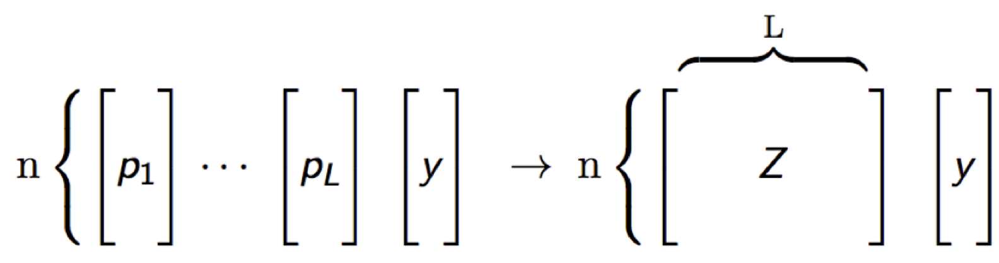

```{r setup, include=FALSE}
knitr::opts_chunk$set(
  echo = TRUE,
  fig.align = "center",
  collapse = TRUE
)
```

```{r, echo=FALSE, out.width="100%", fig.cap="Super Learner."}
knitr::include_graphics("./images/h2oEnsemble.png")
```


## Introduction

[Stacking](https://en.wikipedia.org/wiki/Ensemble_learning#Stacking) (sometimes called "stacked generalization") involves training a learning algorithm to combine the predictions of several other learning algorithms. First, all of the other algorithms are trained using the available data, then a combiner algorithm, the *metalearner*, is trained to make a final prediction using all the predictions of the other algorithms as additional inputs. If an arbitrary metalearning algorithm is used, then stacking can theoretically represent any of the ensemble techniques described in this article, although in practice, a single-layer [logistic regression](https://en.wikipedia.org/wiki/Logistic_regression) model is often used for metalearning.

Stacking typically yields performance better than any single one of the trained models in the ensemble.

## Background

[Leo Breiman](https://en.wikipedia.org/wiki/Leo_Breiman), known for his work on classification and regression trees and the creator of the Random Forest algorithm, formalized stacking in his 1996 paper, ["Stacked Regressions"](http://statistics.berkeley.edu/sites/default/files/tech-reports/367.pdf). Although the idea originated with David Wolpert in 1992 under the name "Stacked Generalization", the modern form of stacking that uses internal k-fold cross-validation was Dr. Breiman's contribution.

However, it wasn't until 2007 that the [theoretical background](http://dx.doi.org/10.2202/1544-6115.1309) for stacking was developed, which is when the algorithm took on the name, "Super Learner". Until this time, the mathematical reasons for why stacking worked were unknown and stacking was considered a "black art." The Super Learner algorithm learns the optimal combination of the base learner fits. In an article titled, "Super Learner", by Mark van der Laan et al., proved that the Super Learner ensemble represents an asymptotically optimal system for learning.

## Common Types of Ensemble Methods

In statistics and machine learning, ensemble methods use multiple learning algorithms to obtain better predictive performance than could be obtained by any of the constituent algorithms.

### Bagging

- Reduces variance and increases accuracy
- Robust against outliers or noisy data
- Often used with Decision Trees (i.e. Random Forest)

### Boosting

- Also reduces variance and increases accuracy
- Not robust against outliers or noisy data
- Flexible - can be used with any loss function

### Stacking

- Used to ensemble a diverse group of strong learners
- Involves training a second-level machine learning algorithm called a "metalearner" to learn the optimal combination of the base learners

## The Super Learner Algorithm

A common task in machine learning is to perform model selection by specifying a number of models with different parameters.  An example of this is Grid Search.  The first phase of the Super Learner algorithm is computationally equivalent to performing model selection via cross-validation.  The latter phase of the Super Learner algorithm (the metalearning step) is just training another single model (no cross-validation) on the *level one* data.

### 1. Set up the ensemble

- Specify a list of $L$ base algorithms (with a specific set of model parameters).  These are also called *base learners*.
- Specify a metalearning algorithm (just another algorithm).

### 2. Train the ensemble

#### Cross-validate Base Learners

- Perform k-fold cross-validation on each of these learners and collect the cross-validated predicted values from each of the $L$ algorithms.
- The $N$ cross-validated predicted values from each of the $L$ algorithms can be combined to form a new $N \times L$ matrix. This matrix, along wtih the original response vector, is called the "level-one" data.


```{r, echo=FALSE, out.width="70%", fig.cap="Stacking."}

```

#### Metalearning

- Train the metalearning algorithm on the level-one data.
- Train each of the $L$ base algorithms on the full training set.
- The "ensemble model" consists of the $L$ base learning models and the metalearning model, which can then be used to generate predictions on a test set.

### 3. Predict on new data

- To generate ensemble predictions, first generate predictions from the base learners.
- Feed those predictions into the metalearner model to generate the ensemble prediction.

## Stacking Software in R

Stacking is a broad class of algorithms that involves training a second-level "metalearner" to ensemble a group of base learners.  The three packages in the R ecosystem which implement the Super Learner algorithm (stacking on cross-validated predictions) are [SuperLearner](https://github.com/ecpolley/SuperLearner), [subsemble](https://github.com/ledell/subsemble) and [h2oEnsemble](https://github.com/h2oai/h2o-3/tree/master/h2o-r/ensemble).

Among ensemble software in R, there is also [caretEnsemble](https://github.com/zachmayer/caretEnsemble), but it implements a boostrapped (rather than cross-validated) version of stacking via the `caretStack()` function.  The bootstrapped version will train faster since bootrapping (with a train/test) is a fraction of the work as k-fold cross-validation, however the the ensemble performance suffers as a result of this shortcut.

### SuperLearner

Authors: Eric Polley, Erin LeDell, Mark van der Laan  

Backend: R with constituent algorithms written in a variety of languages

The original Super Learner implemenation is the [SuperLearner](https://github.com/ecpolley/SuperLearner) R package (2010).

Features: 

- Implements the Super Learner prediction method (stacking) and contains a library of prediction algorithms to be used in the Super Learner.
- Provides a clean interface to 30+ algorithms in R and defines a consistent API for extensibility.
- GPL-3 Licensed.

### subsemble

Authors: Erin LeDell, Stephanie Sapp

Backend: R with constituent algorithms written in a variety of languages

[Subsemble](https://github.com/ledell/subsemble) is a general subset ensemble prediction method, which can be used for small, moderate, or large datasets. Subsemble partitions the full dataset into subsets of observations, fits a specified underlying algorithm on each subset, and uses a unique form of k-fold cross-validation to output a prediction function that combines the subset-specific fits. An oracle result provides a theoretical performance guarantee for Subsemble.

Features:

- Implements the Subsemble Algorithm.
- Implements the Super Learner Algorithm (stacking).
- Uses the SuperLearner wrapper interface for defining base learners and metalearners.
- Multicore and multi-node cluster support via the [snow](https://cran.r-project.org/web/packages/snow/index.html) R package.
- Improved parallelization over the SuperLearner package.
- Apache 2.0 Licensed.

### H2O Ensemble

Authors: Erin LeDell

Backend: Java

H2O Ensemble has been implemented as a stand-alone R package called [h2oEnsemble](https://github.com/h2oai/h2o-3/tree/master/h2o-r/ensemble). The package is an extension to the [h2o](https://cran.r-project.org/web/packages/h2o/index.html) R package that allows the user to train an ensemble in the H2O cluster using any of the supervised machine learning algorithms H2O.

Features:

- Uses data-distributed and parallelized Java-based algorithms for the ensemble.
- All training and data processing are performed in the high-performance H2O cluster rather than in R memory.
- Supports regression and binary classification.
- Multi-class support in development.
- Code refactor underway (moving from a separate R package into H2O "proper") so that the H2O Ensemble interface can be exposed in Python and Scala.
- Apache 2.0 Licensed.

```{r stderr, eval=FALSE}
# Install required packages
install.packages("devtools")
install.packages("h2o")

# Install h2oEnsemble from GitHub
library(devtools)
install_github("h2oai/h2o-3/h2o-r/ensemble/h2oEnsemble-package")
library(h2oEnsemble)
```


```{r load, echo=FALSE}
library(h2oEnsemble)
```

### Higgs Demo

This is an example of binary classification using the `h2o.ensemble` function, which is available in **h2oEnsemble**.  This demo uses a subset of the [HIGGS dataset](https://archive.ics.uci.edu/ml/datasets/HIGGS), which has 28 numeric features and a binary response.  The machine learning task in this example is to distinguish between a signal process which produces Higgs bosons (Y = 1) and a background process which does not (Y = 0).  The dataset contains approximately the same number of positive vs negative examples.  In other words, this is a balanced, rather than imbalanced, dataset.
   
If run from plain R, execute R in the directory of this script. If run from RStudio, be sure to setwd() to the location of this script. h2o.init() starts H2O in R's current working directory. h2o.importFile() looks for files from the perspective of where H2O was started.

#### Start H2O Cluster

```{r, init_h2o}
h2o.init(nthreads = -1)  # Start an H2O cluster with nthreads = num cores on your machine
h2o.removeAll() # (Optional) Remove all objects in H2O cluster
```


#### Load Data into H2O Cluster

First, import a sample binary outcome train and test set into the H2O cluster.

```{r data_import, results='hide'}
train <- h2o.importFile("https://s3.amazonaws.com/erin-data/higgs/higgs_train_5k.csv")
test <- h2o.importFile("https://s3.amazonaws.com/erin-data/higgs/higgs_test_5k.csv")

y <- "response"
x <- setdiff(names(train), y)
family <- "binomial"
```


For binary classification, the response should be encoded as a [factor](http://stat.ethz.ch/R-manual/R-patched/library/base/html/factor.html) type (also known as the [enum](https://docs.oracle.com/javase/tutorial/java/javaOO/enum.html) type in Java or [categorial](http://pandas.pydata.org/pandas-docs/stable/categorical.html) in Python Pandas).  The user can specify column types in the `h2o.importFile` command, or you can convert the response column as follows:

```{r train_test}
train[, y] <- as.factor(train[, y])  
test[, y] <- as.factor(test[, y])
```

#### Specify Base Learners & Metalearner

For this example, we will use the default base learner library for `h2o.ensemble`, which includes the default H2O GLM, Random Forest, GBM and Deep Neural Net (all using default model parameter values).  We will also use the default metalearner, the H2O GLM.

```{r default_learners}
learner <- c("h2o.glm.wrapper", "h2o.randomForest.wrapper", 
             "h2o.gbm.wrapper", "h2o.deeplearning.wrapper")
metalearner <- "h2o.glm.wrapper"
```

#### Train an Ensemble

Train the ensemble (using 5-fold internal CV) to generate the level-one data.  Note that more CV folds will take longer to train, but should increase performance.

```{r train_ens, results='hide'}
fit <- h2o.ensemble(x = x, y = y, 
                    training_frame = train, 
                    family = family, 
                    learner = learner, 
                    metalearner = metalearner,
                    cvControl = list(V = 5))
```

#### Evaluate Model Performance

Since the response is binomial, we can use Area Under the ROC Curve ([AUC](https://www.kaggle.com/wiki/AUC)) to evaluate the model performance.  Compute test set performance, and sort by AUC (the default metric that is printed for a binomial classification):

```{r perf, results='hide'}
perf <- h2o.ensemble_performance(fit, newdata = test)
```

Print the base learner and ensemble performance:

```{r print_perf}
perf
```


We can compare the performance of the ensemble to the performance of the individual learners in the ensemble.

So we see the best individual algorithm in this group is the GBM with a test set AUC of 0.778, as compared to 0.781 for the ensemble.  At first thought, this might not seem like much, but in many industries like medicine or finance, this small advantage can be highly valuable. 

To increase the performance of the ensemble, we have several options.  One of them is to increase the number of internal cross-validation folds using the `cvControl` argument.  The other options are to change the base learner library or the metalearning algorithm.

Note that the ensemble results above are not reproducible since `h2o.deeplearning` is not reproducible when using multiple cores, and we did not set a seed for `h2o.randomForest.wrapper`.

If we want to evaluate the model by a different metric, say "MSE", then we can pass that metric to the `print` method for and ensemble performance object as follows:

```{r perf_mse}
print(perf, metric = "MSE")
```

#### Predict 

If you actually need to generate the predictions (instead of looking only at model performance), you can use the `predict()` function with a test set.  Generate predictions on the test set and store as an H2O Frame:

```{r pred, message=FALSE, results='hide'}
pred <- predict(fit, newdata = test)
```

If you need to bring the predictions back into R memory for futher processing, you can convert `pred` to a local R data.frame as follows:

```{r pred_df}
predictions <- as.data.frame(pred$pred)[,3]  #third column is P(Y==1)
labels <- as.data.frame(test[,y])[,1]
```

The `predict` method for an `h2o.ensemble` fit will return a list of two objects.  The `pred$pred` object contains the ensemble predictions, and `pred$basepred` is a matrix of predictions from each of the base learners.  In this particular example where we used four base learners, the `pred$basepred` matrix has four columns.  Keeping the base learner predictions around is useful for model inspection and will allow us to calculate performance of each of the base learners on the test set (for comparison to the ensemble).


#### Specifying new learners

Now let's try again with a more extensive set of base learners.  The **h2oEnsemble** packages comes with four functions by default that can be customized to use non-default parameters. 

Here is an example of how to generate a custom learner wrappers:

```{r new_learners}
h2o.glm.1 <- function(..., alpha = 0.0) h2o.glm.wrapper(..., alpha = alpha)
h2o.glm.2 <- function(..., alpha = 0.5) h2o.glm.wrapper(..., alpha = alpha)
h2o.glm.3 <- function(..., alpha = 1.0) h2o.glm.wrapper(..., alpha = alpha)

h2o.randomForest.1 <- function(..., ntrees = 200, nbins = 50, seed = 1) h2o.randomForest.wrapper(..., ntrees = ntrees, nbins = nbins, seed = seed)
h2o.randomForest.2 <- function(..., ntrees = 200, sample_rate = 0.75, seed = 1) h2o.randomForest.wrapper(..., ntrees = ntrees, sample_rate = sample_rate, seed = seed)
h2o.randomForest.3 <- function(..., ntrees = 200, sample_rate = 0.85, seed = 1) h2o.randomForest.wrapper(..., ntrees = ntrees, sample_rate = sample_rate, seed = seed)
h2o.randomForest.4 <- function(..., ntrees = 200, nbins = 50, balance_classes = TRUE, seed = 1) h2o.randomForest.wrapper(..., ntrees = ntrees, nbins = nbins, balance_classes = balance_classes, seed = seed)

h2o.gbm.1 <- function(..., ntrees = 100, seed = 1) h2o.gbm.wrapper(..., ntrees = ntrees, seed = seed)
h2o.gbm.2 <- function(..., ntrees = 100, nbins = 50, seed = 1) h2o.gbm.wrapper(..., ntrees = ntrees, nbins = nbins, seed = seed)
h2o.gbm.3 <- function(..., ntrees = 100, max_depth = 10, seed = 1) h2o.gbm.wrapper(..., ntrees = ntrees, max_depth = max_depth, seed = seed)
h2o.gbm.4 <- function(..., ntrees = 100, col_sample_rate = 0.8, seed = 1) h2o.gbm.wrapper(..., ntrees = ntrees, col_sample_rate = col_sample_rate, seed = seed)
h2o.gbm.5 <- function(..., ntrees = 100, col_sample_rate = 0.7, seed = 1) h2o.gbm.wrapper(..., ntrees = ntrees, col_sample_rate = col_sample_rate, seed = seed)
h2o.gbm.6 <- function(..., ntrees = 100, col_sample_rate = 0.6, seed = 1) h2o.gbm.wrapper(..., ntrees = ntrees, col_sample_rate = col_sample_rate, seed = seed)
h2o.gbm.7 <- function(..., ntrees = 100, balance_classes = TRUE, seed = 1) h2o.gbm.wrapper(..., ntrees = ntrees, balance_classes = balance_classes, seed = seed)
h2o.gbm.8 <- function(..., ntrees = 100, max_depth = 3, seed = 1) h2o.gbm.wrapper(..., ntrees = ntrees, max_depth = max_depth, seed = seed)

h2o.deeplearning.1 <- function(..., hidden = c(500,500), activation = "Rectifier", epochs = 50, seed = 1)  h2o.deeplearning.wrapper(..., hidden = hidden, activation = activation, seed = seed)
h2o.deeplearning.2 <- function(..., hidden = c(200,200,200), activation = "Tanh", epochs = 50, seed = 1)  h2o.deeplearning.wrapper(..., hidden = hidden, activation = activation, seed = seed)
h2o.deeplearning.3 <- function(..., hidden = c(500,500), activation = "RectifierWithDropout", epochs = 50, seed = 1)  h2o.deeplearning.wrapper(..., hidden = hidden, activation = activation, seed = seed)
h2o.deeplearning.4 <- function(..., hidden = c(500,500), activation = "Rectifier", epochs = 50, balance_classes = TRUE, seed = 1)  h2o.deeplearning.wrapper(..., hidden = hidden, activation = activation, balance_classes = balance_classes, seed = seed)
h2o.deeplearning.5 <- function(..., hidden = c(100,100,100), activation = "Rectifier", epochs = 50, seed = 1)  h2o.deeplearning.wrapper(..., hidden = hidden, activation = activation, seed = seed)
h2o.deeplearning.6 <- function(..., hidden = c(50,50), activation = "Rectifier", epochs = 50, seed = 1)  h2o.deeplearning.wrapper(..., hidden = hidden, activation = activation, seed = seed)
h2o.deeplearning.7 <- function(..., hidden = c(100,100), activation = "Rectifier", epochs = 50, seed = 1)  h2o.deeplearning.wrapper(..., hidden = hidden, activation = activation, seed = seed)
```

Let's grab a subset of these learners for our base learner library and re-train the ensemble.

#### Customized base learner library

```{r apply_learners}
learner <- c("h2o.glm.wrapper",
             "h2o.randomForest.1", "h2o.randomForest.2",
             "h2o.gbm.1", "h2o.gbm.6", "h2o.gbm.8",
             "h2o.deeplearning.1", "h2o.deeplearning.6", "h2o.deeplearning.7")
```


Train with new library:

```{r train_new_learners, results='hide'}
fit <- h2o.ensemble(x = x, y = y, 
                    training_frame = train,
                    family = family, 
                    learner = learner, 
                    metalearner = metalearner,
                    cvControl = list(V = 5))
```

Evaluate the test set performance: 

```{r new_perf, message=FALSE, results='hide'}
perf <- h2o.ensemble_performance(fit, newdata = test)
```

We see an increase in performance by including a more diverse library.

Base learner test AUC (for comparison)

```{r new_perf2}
perf
```

So what happens to the ensemble if we remove some of the weaker learners?  Let's remove the GLM and DL from the learner library and see what happens...

Here is a more stripped down version of the base learner library used above:

```{r lean_learners}
learner <- c("h2o.randomForest.1", "h2o.randomForest.2",
             "h2o.gbm.1", "h2o.gbm.6", "h2o.gbm.8")
```

Again re-train the ensemble and evaluate the performance:

```{r re_train, message=FALSE, results='hide'}
fit <- h2o.ensemble(x = x, y = y, 
                     training_frame = train,
                     family = family, 
                     learner = learner, 
                     metalearner = metalearner,
                     cvControl = list(V = 5))

perf <- h2o.ensemble_performance(fit, newdata = test)
```

We actually lose ensemble performance by removing the weak learners!  This demonstrates the power of stacking with a large and diverse set of base learners.

```{r new_perf3}
perf
```

At first thought, you may assume that removing less performant models would increase the perforamnce of the ensemble.  However, each learner has it's own unique contribution to the ensemble and the added diversity among learners usually improves performance.  The Super Learner algorithm learns the optimal way of combining all these learners together in a way that is superior to other combination/blending methods.


### Stacking Existing Model Sets

You can also use an existing (cross-validated) list of H2O models as the starting point and use the `h2o.stack()` function to ensemble them together via a specified metalearner.  The base models must have been trained on the same dataset with same response and for cross-validation, must have all used the same folds.

An example follows.  As above, start up the H2O cluster and load the training and test data.

```{r new_example, results='hide'}
# start a new instance
library(h2oEnsemble)
h2o.init(nthreads = -1) # Start H2O cluster using all available CPU threads

# Import a sample binary outcome train/test set into R
train <- h2o.importFile("https://s3.amazonaws.com/erin-data/higgs/higgs_train_5k.csv")
test <- h2o.importFile("https://s3.amazonaws.com/erin-data/higgs/higgs_test_5k.csv")

y <- "response"
x <- setdiff(names(train), y)
family <- "binomial"

#For binary classification, response should be a factor
train[,y] <- as.factor(train[,y])
test[,y] <- as.factor(test[,y])
```

Cross-validate and train a handful of base learners and then use the `h2o.stack()` function to create the ensemble:

```{r train_mult, results='hide'}
# The h2o.stack function is an alternative to the h2o.ensemble function, which
# allows the user to specify H2O models individually and then stack them together
# at a later time.  Saved models, re-loaded from disk, can also be stacked.

# The base models must use identical cv folds; this can be achieved in two ways:
# 1. they be specified explicitly by using the fold_column argument, or
# 2. use same value for `nfolds` and set `fold_assignment = "Modulo"`

nfolds <- 5  

glm1 <- h2o.glm(x = x, y = y, family = family, 
                training_frame = train,
                nfolds = nfolds,
                fold_assignment = "Modulo",
                keep_cross_validation_predictions = TRUE)

gbm1 <- h2o.gbm(x = x, y = y, distribution = "bernoulli",
                training_frame = train,
                seed = 1,
                nfolds = nfolds,
                fold_assignment = "Modulo",
                keep_cross_validation_predictions = TRUE)

rf1 <- h2o.randomForest(x = x, y = y, # distribution not used for RF
                        training_frame = train,
                        seed = 1,
                        nfolds = nfolds,
                        fold_assignment = "Modulo",
                        keep_cross_validation_predictions = TRUE)

dl1 <- h2o.deeplearning(x = x, y = y, distribution = "bernoulli",
                        training_frame = train,
                        nfolds = nfolds,
                        fold_assignment = "Modulo",
                        keep_cross_validation_predictions = TRUE)

models <- list(glm1, gbm1, rf1, dl1)
metalearner <- "h2o.glm.wrapper"

stack <- h2o.stack(models = models,
                   response_frame = train[,y],
                   metalearner = metalearner, 
                   seed = 1,
                   keep_levelone_data = TRUE)


# Compute test set performance:
perf <- h2o.ensemble_performance(stack, newdata = test)
```

Print base learner and ensemble test set performance:

```{r final_perf}
print(perf)
```

#### All done, shutdown H2O

```{r shutdown}
h2o.shutdown()
```

